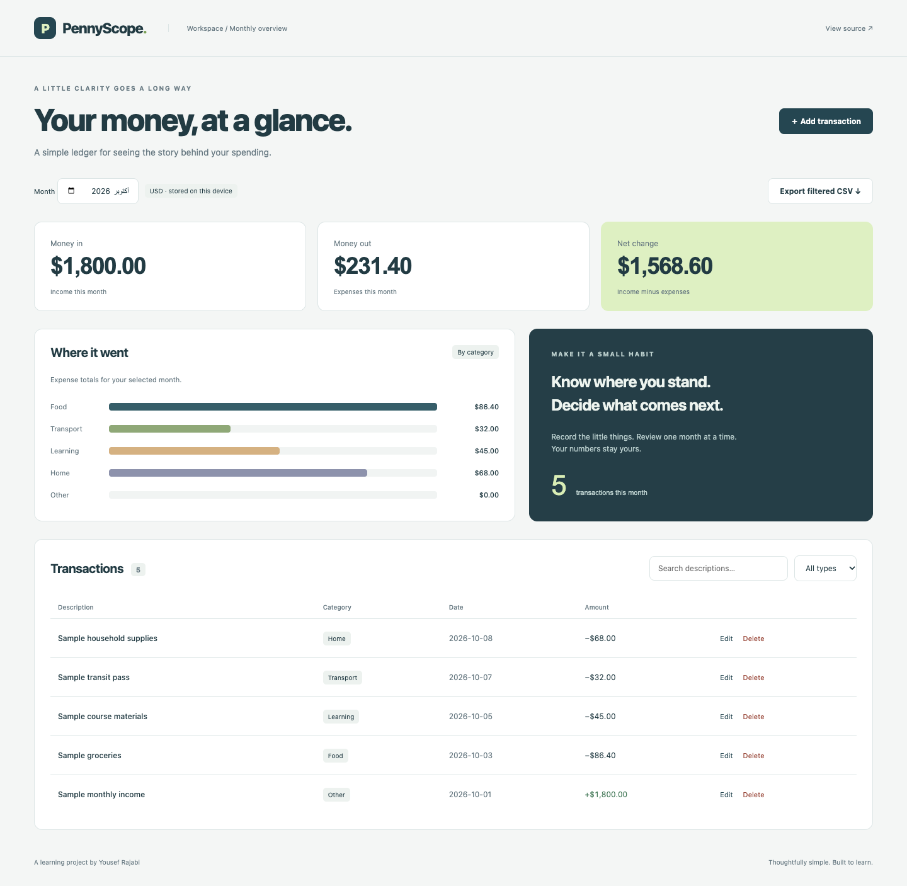

# PennyScope

A personal cash-flow dashboard with a clear, editable transaction ledger.

**A junior-level, AI-assisted portfolio learning project by Yousef Rajabi.**



[Mobile screenshot](docs/screenshots/mobile.png) · [Learning guide](docs/LEARNING.md) · [Checks](https://github.com/yousefrajabi06-debug/pennyscope/actions)

Screenshots show the running application with fictional sample data. They are not design mockups. This repository does not currently advertise a hosted demo.

## Why this project

Adds numeric aggregation and data visualization to a portfolio that already contained basic task and client CRUD apps.

## Features

- Create, edit, and delete income and expense entries with confirmation.
- Review monthly income, spending, balance, and category bars.
- Search and filter the ledger; export the current view as CSV.
- Store amounts as integer cents and format USD with Intl.NumberFormat.
- Keep records in localStorage, validate saved data, and show storage failures.
- Start with an empty account or explicitly load fictional sample transactions.

## Tech Stack

React 19, JavaScript, Vite, CSS, localStorage, Playwright.

## Installation

Use **Node.js 24+** and npm. Install dependencies from the project directory:

```bash
git clone https://github.com/yousefrajabi06-debug/pennyscope.git
cd pennyscope
npm install
npm run dev
```

Open the local Vite URL printed in the terminal (normally http://127.0.0.1:5173).

No secret API keys are required. Never put credentials in frontend code. Dependencies are locked in `package-lock.json`; use `npm ci` for a reproducible clean install.

## Production build

```bash
npm run build
npm run preview
```

The build output is `dist/`. Preview is a local build check, not a hosted production service.

## Tests

```bash
npx playwright install chromium
npm test
```

If Chrome is already installed locally, macOS/Linux users can instead run `PLAYWRIGHT_CHANNEL=chrome npm test`. Browser tests use local development servers. GitHub Actions performs `npm ci`, builds the project, installs Chromium, and runs the tests on pushes and pull requests.

Three browser tests cover CRUD, cents arithmetic, persistence, filters, category totals, safe CSV export, malformed storage, and mobile overflow.

## Source organization

- [`src/App.jsx`](src/App.jsx): State, derived totals, month/category/search filters, and CRUD handlers.
- [`src/components/EntryForm.jsx`](src/components/EntryForm.jsx): Controlled form and amount validation.
- [`src/components/SpendingChart.jsx`](src/components/SpendingChart.jsx): Accessible category totals and CSS bars.
- [`src/lib/ledger.js`](src/lib/ledger.js): Integer cents, aggregation, saved-data validation, and CSV escaping.
- [`src/hooks/useSavedState.js`](src/hooks/useSavedState.js): Reading and saving browser data with failure handling.
- [`tests/app.spec.js`](tests/app.spec.js): CRUD, arithmetic, CSV safety, persistence, and mobile checks.

## What I Learned

This AI-assisted implementation provides practice with the following concepts. These are study outcomes to work through, not a claim that every line was written independently:

- Trace how a form amount becomes integer cents before it is stored.
- Use filter and reduce to derive a monthly summary without extra React state.
- Explain immutable updates when editing or deleting a transaction.
- Understand why a CSV cell beginning with a formula character needs neutralization.
- Trace localStorage initialization and what happens when writes fail.

See [the learning guide](docs/LEARNING.md) for an independent feature exercise and a rebuild plan.

## Limitations and data

USD only, manual entry, one browser, no bank connection, encryption, account, or cloud backup. Clearing browser storage deletes records. Synchronous local reads have no artificial loading screen; storage failures and empty/filter states are visible.

The responsive UI includes visible keyboard focus and labeled controls. Browser tests are useful regression checks; they are not a complete accessibility audit. No private personal data, real credentials, generated databases, or `.env` files are committed. External Google Fonts are optional cosmetic requests; system font fallbacks keep the interface usable if fonts are unavailable.

## Future Improvements

- Multiple currencies with explicit conversion rules.
- Import validation and a preview before restoring an exported backup.
- More chart keyboard descriptions and date-boundary tests.

## Authorship and AI assistance

Created for Yousef Rajabi's student portfolio with AI assistance in planning, implementation, testing, and documentation. Original project code was built for this portfolio; it was not copied from another GitHub application. Third-party libraries remain credited through the Tech Stack and dependency files. This is learning work, not paid client work or invented professional experience.
